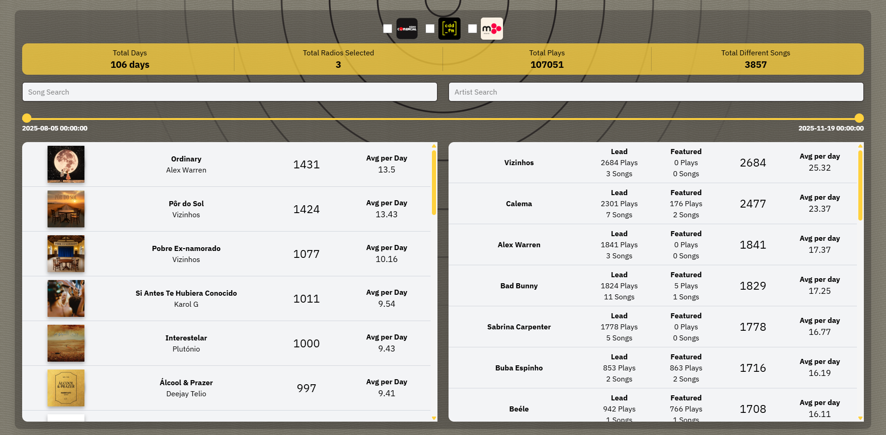
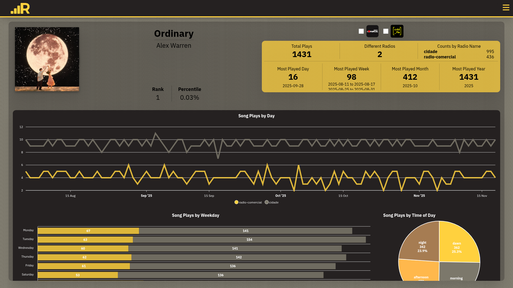
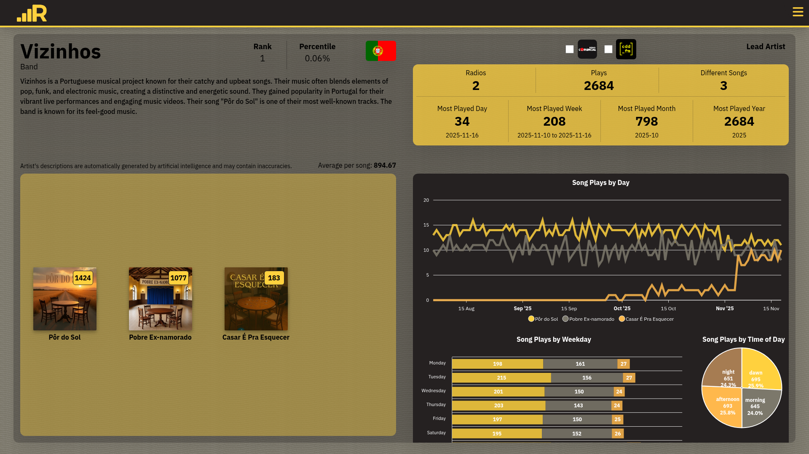
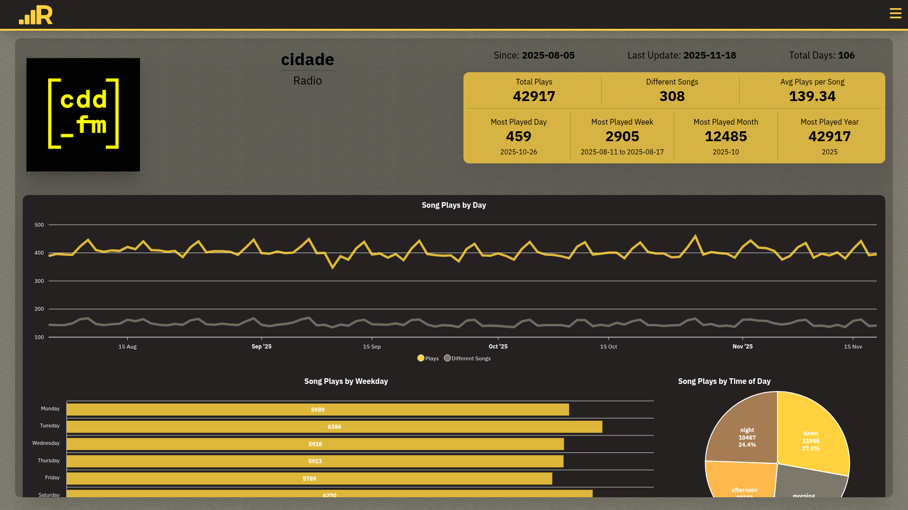

# RadioStats

https://radiostats.ffpereira.com/

**RadioStats** is a **full-stack personal project** designed to analyze and visualize the most frequently played songs on Portuguese radio stations owned by the Bauer Media Group. Data is collected automatically and updated daily at **1 AM**, reflecting the previous day’s broadcasts.

> ⚠️ **Disclaimer:** This project is not affiliated, endorsed, or sponsored in any way by Bauer Media Group or its subsidiaries. All data is obtained from publicly accessible sources, and no personally identifiable information is collected, stored, or shared.

Descriptions and nationalities of artists are produced **automatically with artificial intelligence** and are provided for informational purposes only. As such, they may contain inaccuracies or approximations. **All songs, albums, and artists content remain the intellectual property of their respective owners.**

This project is **strictly non-commercial**, developed in accordance with best practices for data privacy and responsible usage, and intended solely for research and educational purposes. The author disclaims any liability for errors, omissions, or inaccuracies in the data presented.

---

---

## Features

- Full-stack implementation: Python backend + React frontend  
- Daily automated data collection and updates  
- Interactive charts for songs, artists, and radio stations  
- AI-generated artist descriptions and nationalities
- Hoverable vinyl cases with audio snippets
- Filtering by radio station, date range, and search by song or artist  
- Info buttons explaining the project on every page  
- API documentation available at `/api/docs`

---

## Technology Stack

**Backend:**

- Python 3.12
- Flask for REST API  
- PostgreSQL database with ORM via `Flask-Alchemical`  
- Marshmallow for data serialization  
- API Fairy for automatic API documentation  
- Pytest for testing  
- Cron jobs for scheduled data updates (`data.py`, `update_artists.py`)  

**Frontend:**

- React 19.1 (via Vite)  
- TailwindCSS 4.1 for responsive design  
- GSAP 3.13 for animations  
- ApexCharts 1.7 for interactive charts  

---

## Pages

### Home Page
Shows the most played songs and artists. Filters include radio station, date range, and search by song or artist.  

  

### Song Page
Detailed view of a song including:  
- Play history, rankings, and percentile  
- Filters by radio station  
- **Charts (by Radio)**: Plays by Day, Weekday, Time of Day, and Hour  

  

### Artist Page
Detailed view of an artist including:  
- Top songs, play history, rankings, and percentile  
- AI-generated descriptions and nationality  
- Filters by radio station  
- **Charts (by Song)**: Plays by Day, Weekday, Time of Day, and Hour  

  

### Radio Page
Detailed view of a radio station including:  
- Top songs and artists  
- Play history, rankings, and percentile  
- **Charts**: Plays by Day, Weekday, Time of Day, and Hour  

  

---

## License

This project is licensed under the [MIT License](LICENSE).

---

## Acknowledgements

This project's structure was inspired by Miguel Grinberg's excellent tutorial: [React Mega-Tutorial](https://blog.miguelgrinberg.com/post/introducing-the-react-mega-tutorial)

---

## Contact

For questions or feedback, you can reach me at: [radiostats@ffpereira.com](mailto:radiostats@ffpereira.com)